**„Adatbázisok Labor" adminisztrációs rendszer funkcionális specifikáció**

1. Bejelentkezés

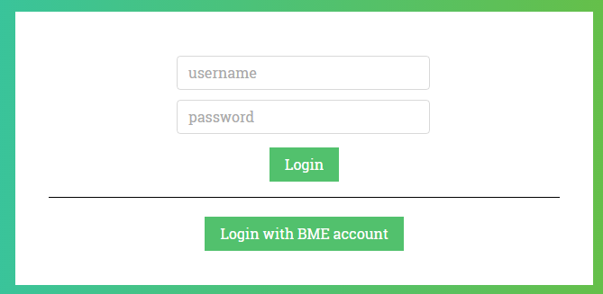

Bejelentkezés

Az alkalmazásba Sibboleth-tel, illetve felhasználónév és jelszó páros megadásával lehet belépni. Sikeres authentikáció után a felhasználó számára betöltődik az ő szerepköréhez tartozó felület. Új jelszót lehet kérni, ha a felhasználó elfejeltette volna azt.

2. Általános funkciók

1. Hírek olvasása

2. Kijelentkezés

3. Felhasználói beállítások

4. Ha nincs joga az oldalhoz, és nincs bejelentkezve, akkor átirányítás a belépésre. Ha már belépett, de nincs joga, akkor hiba kiírása. Belépés után mindig oda írányítsa vissza, mint ahol belépett.

3. Admin szerepkör funkcióinak felsorolása

Admin szerepkör funkciói

1. Felhasználóval kapcsolatos folyamatok:

    1. adott jelszó beállítása, vagy véletlenszerű jelszó generálása

        1. (Jelszógenerálás esetén 0 és O illetve 1, l(L), I(i) betűk kerülendőek)

    2. e-mail cím manuális jóváhagyása

    3. új felhasználó felvétele

    4. felhasználó módosítása (TEST!!!! Naplózás)

    5. jogosultságok megtekintése

    6. jogosultságok hozzáadása

    7. jogosultságok módosítása

    8. jogosultságok törlése

    9. keresés név alapján

    10. keresés user név alapján

    11. keresés azonosítószám alapján

    12. felhasználó megszemélyesítése

    13. javító esetén a javítandó feladatok típusának beállítása

2. Hallgatói adatok feltöltése CSV állomány segítségével

3. Mérésvezetőkkel kapcsolatos folyamatok:

    14. adataik felvitele

    15. hallgatók és mérésvezetők összerendelése

    16. hallgatók és mérésvezetők összerendelése félév közben is

    17. mérésvezetők és méréshelyek összerendelése

    18. mérésvezetők és mérésidőpontok összerendelése

4. Értékelők, feladattípusok és hallgatók összerendelése

5. Eredményekhez, statisztikákhoz tartozó funkciók:

    19. Részletes eredmények listázása csoportonként

    20. Részletes eredmények listázása hallgatóként

    21. Összesített eredmények listázása csoportonként

    22. Összesített eredmények listázása hallgatóként

    23. Eredmények exportálása CSV állományba

    24. Házi feladatok esetén a feladattípusonként a nem véglegesített jegyzőkönyvek számának listázása javítók szerint

    25. Lezáratlan mérésjegyek számának (van jegyzőkönyvjegy, de nincs laborjegy) listázása mérésvezetők szerint

    26. Javítók terheltségének listázása

6. Határidők, szünnapok kezelése:

    27. Hallgatói jegyzőkönyvek leadásának határidejének kitolása mérésenként, illetve globálisan

    28. Jegyzőkönyv értékelésének határidejének változtatása mérésenként, illetve globálisan

    29. Egyedi hallgató esetén a határidő kitolása

7. Méréshelyek és időpontok kezelése:

    30. Új mérés létrehozása

    31. Pót mérés létrehozása

    32. Jelenlegi méréshely megváltoztatása

    33. Jelenlegi mérésidőpont megváltoztatása

    34. Mérés típusának (sql, oracle, …) megváltoztatása

    35. Mérésvezető megváltoztatása

8. Jegyzőkönyvek kezelése:

    36. Jegyzőkönyv archiválása (plágiumkeresés)

9. Hírek, hirdetmények kezelése:

    37. Hírek feltölése

    38. Hírek szerkesztése

    39. Hírek törlése

    40. Hírek kezeljék a MD formátumot (Opcionális)

10. Véglegesítés visszavonása

    41. Beugró esetén

    42. Jegyzőkönyv esetén

    43. Végleges jegy esetén

11. SQL szkriptek futtatása (Opcionális, ha mindent lehet frontendről, akkor ne)

12. (Beugrókkal kapcsolatos funkciók:

    44. Új kérdés hozzáadása

    45. Kérdés módosítása

    46. 4-7 darab kérdés kiválasztása és nyomtatható fájl létrehozása)

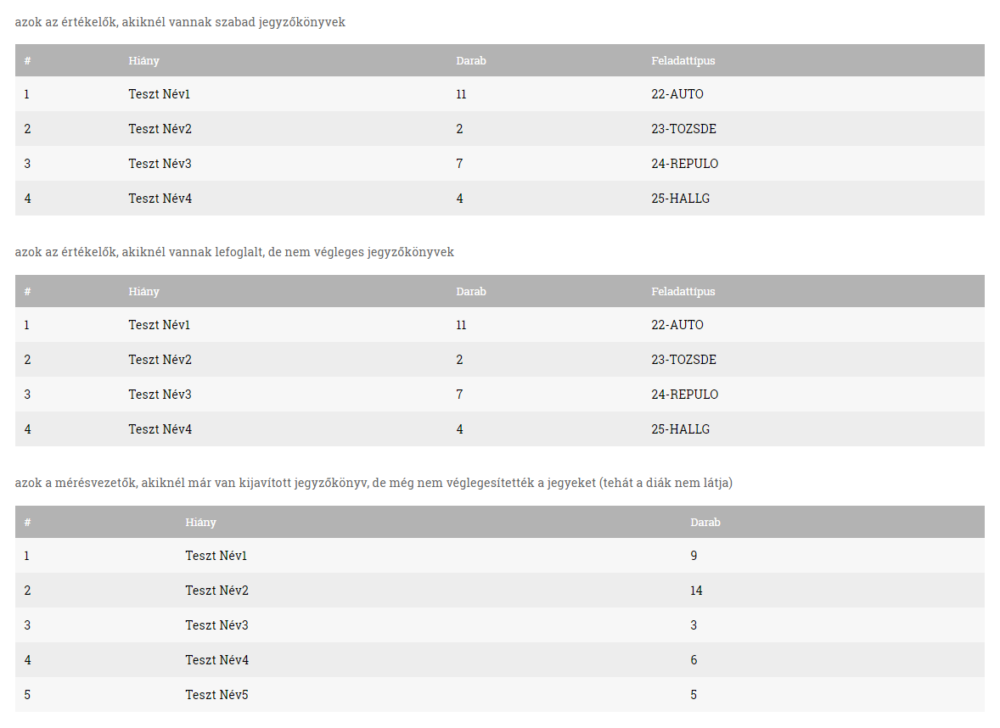

Statisztikák

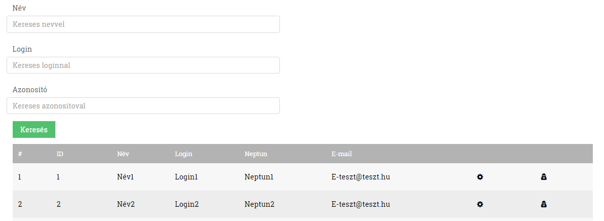

Felhasználók keresése, áttekintése

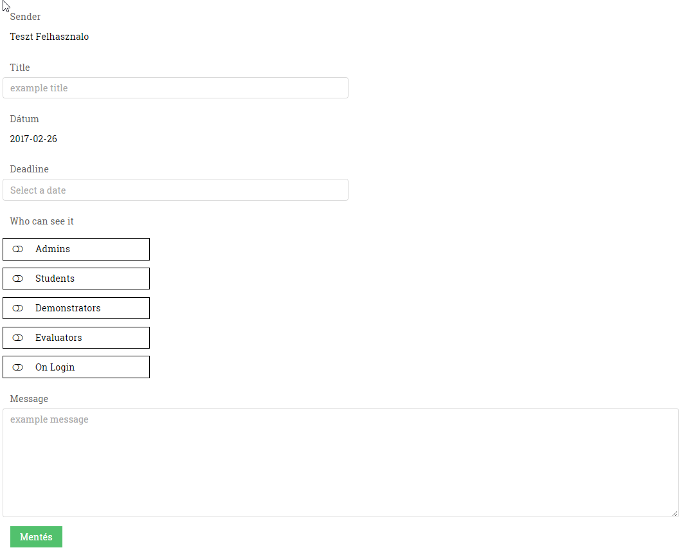

Hír létrehozása

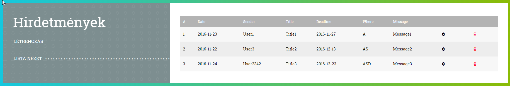

Hírek listázása (szerkesztése, törlése)

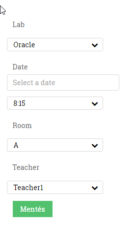

Mérés létrehozása

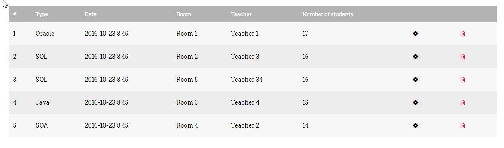

Mérések listázása

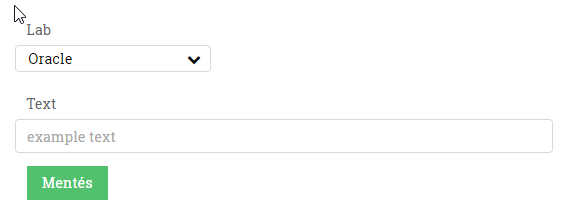

Beugró létrehozása adott laborhoz

Beugrók listája

4. Hallgató szerepkör funkcióinak felsorolása

1. Saját eredmények megtekintése

2. Mérésekhez tartozó funkciók:

    1. Mérés helyszínének megjelenítése

    2. Mérés időpontjának megjelenítése

    3. Mérésvezető személyének megjelenítése

    4. Mérésvezető elérhetőségei

    5. Jegyzőkönyv leadásának határidejének megtekintése

    6. (Leadott jegyzőkönyvek megtekintése, ha minden gitben lesz, akkor annyira nem fontos)

    7. Végleges értékelésének megjelenítése

        1. Beugró jegy

        2. Jegyzőkönyv jegy

        3. Jegyzőkönyv report

        4. Javító neve

        5. Labor jegy

        6. Labor report

    8. Megjegyzések megjelenítése

    9. (Saját jegyzőkönyv megjelenítése)

    10. Végleges eredmények megjelenítése

    11. Git remote URL elérése

    12. Minden egyes tag kilistázása az adott labor repository-jából

    13. Tag beállítása végleges verziónak

        7. (Amennyiben lejár a határidő, a backend minden branch utolsó commitját tageli. Amennyiben nem jelölt meg a hallgató egyetlen egy taget se végleges verziónak, akkor csak a master branch commitját veszi figyelembe a backend, és a javító az alapján fog pontozni)

3. Kezdeti jelszavak megtekintése (rapid, Oracle DB, etc.)

Hallgató szerepkör funkciói

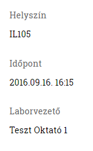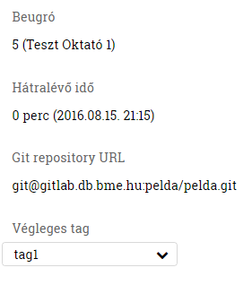

Általános információk / Megtartott, de még nem értékelt labor

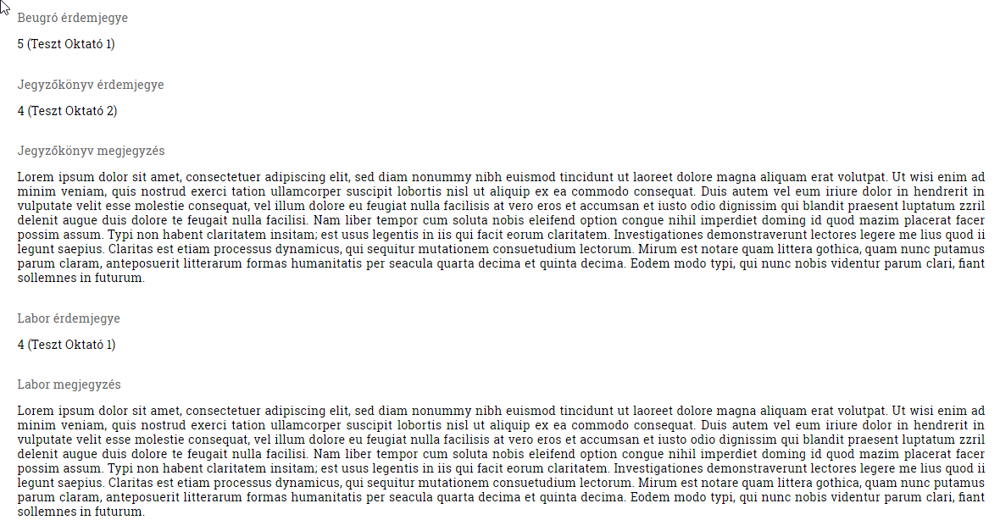

Értékelt labor

5. Javító szerepkör funkcióinak felsorolása

1. Laborok listázása

2. Laborokhoz tartozó funkciók

    1. Javításra váró jegyzőkönyvek lekérdezése

    2. Jegyzőkönyv lefoglalása → ne javítsa egyszerre két javító ugyanazt

    3. Felhasználó által javítandó jegyzőkönyvek lekérése

    4. Felhasználó által véglegesített jegyzőkönyvek lekérése

    5. Más felhasználó által javított jegyzőkönyvek lekérése

3. Felhasználó által javítandó/véglegesített jegyzőkönyvhöz tartozó funkciók

    6. Hallgató nevének lekérdezése

    7. Hallgató neptunjának lekérdezése

    8. Feladattípus lekérdezése

    9. Határidő lekérdezése

    10. Érdemjegy lekérdezése

    11. Érdemjegy módosítása

    12. Megjegyzés lekérdezése

    13. Megjegyzés módosítása

    14. Megjegyzés eltávolítása

    15. Git remote URL elérése (tagname-mel együtt)

    16. Megjegyzések és jegyek véglegesítése

    17. Imsc pont lekerdezese, modositasa, torlese

4. Más felhasználók által javítandó/véglegesített jegyzőkönyvhöz tartozó funckiók

    18. Hallgató nevének lekérdezése

    19. Hallgató neptunjának lekérdezése

    20. Feladattípus lekérdezése

    21. Határidő lekérdezése

    22. Érdemjegy lekérdezése

    23. Javító nevének lekérdezése

    24. Git remote URL elérése (tagname-mel együtt)

Javító szerepkör funkciói

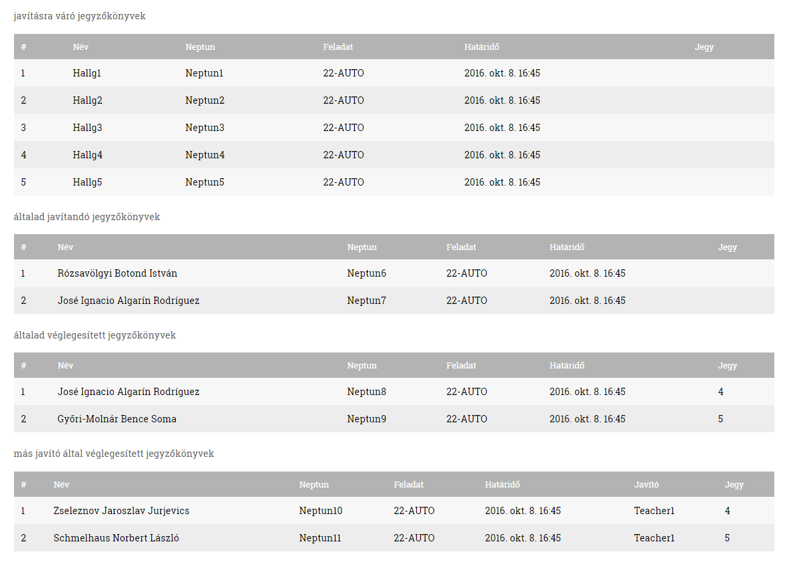

6. Demonstrátor szerepkör funkcióinak felsorolása

1. Laborok listázása

2. Laborokhoz tartozó funkciók

    1. Hallgatók kilistázása → kilistázás után lehessen gyorsan a beugrójegyet módosítani

3. Hallgatókhoz tartozó funkciók

    2. Hallgató nevének lekérdezése

    3. Hallgató neptunjának lekérdezése

    4. Feladattípus lekérdezése

    5. Mérés idejének lekérdezése

    6. Mérés helyének lekérdezése

    7. Hallgató mérésen végzett beugrójának jegye lekérdezése

    8. Hallgató jegyzőkönyv jegyének lekérdezése

    9. Jegyzőkönyv megjegyzésének lekérdezése

    10. Véglegesítés jelzése a megjegyzésekről

    11. Labor érdemjegy lekérdezése

    12. Labor érdemjegy módosítása

    13. Labor megjegyzésének lekérdezése

    14. Labor megjegyzésének módosítása

    15. Labor megjegyzésének törlése

    16. IMSc pontok lekérdezése

    17. Megjegyzések és jegyek véglegesítése

    18. Git remote URL elérése (tagname-mel együtt)

4. (Beugrók listázása

5. Beugrók törlése

6. Beugrókhoz tartozó funkciók

    19. Beugró típus lekérdezése

    20. Beugró szövegének lekérdezése

    21. (Beugró nyomtatása)

Demonstrátor szerepkör funkciói

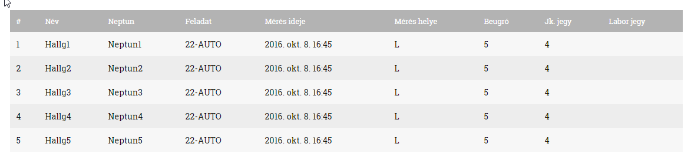

Hallgatók listája

7. Beállítások 

1. Felhasználó megtekintheti saját adatait

2. Felhasználó módosíthatja e-mail címét

3. Felhasználó módosíthatja jelszavát az aktuális, az új illetve az új jelszó ellenőrzésére szolgáló ismétlés megadásával

4. Felhasználó felirtakozhat levelezőlistára

5. Felhasználó feliratkozhat e-mail alapú értesítésekre (új jegy, hír) 

6. Felhasználó megadhatja a saját SSH publikus kulcsát

7. Felhasználó nem módosíthatja saját nevét és neptun kódját

8. Amennyiben a felhasználó nem rendelkezik megadott e-mail címmel, bejelentkezés után erre az oldalra irányítandó

9. (Jelszógenerálás esetén 0 és O illetve 1, l(L), I(i) betűk kerülendőek)

10. Amennyiben változott a felhasználó e-mail címe, ellenőrző levél fog kiküldésre kerülni. 

11. Az ellenőrző e-mail időkorlátos, amennyiben a felhasználó nem erősíti meg, az előző e-mail cím automatikusan visszaírásra kerül

12. Ellenőrző e-mail kiküldését lehet újrakérni, amennyiben az nem érkezett meg a felhasználónak.

13. Hibás vagy felhasznált ellenőrző token esetén dobjon a rendszer hibaüzenetet.

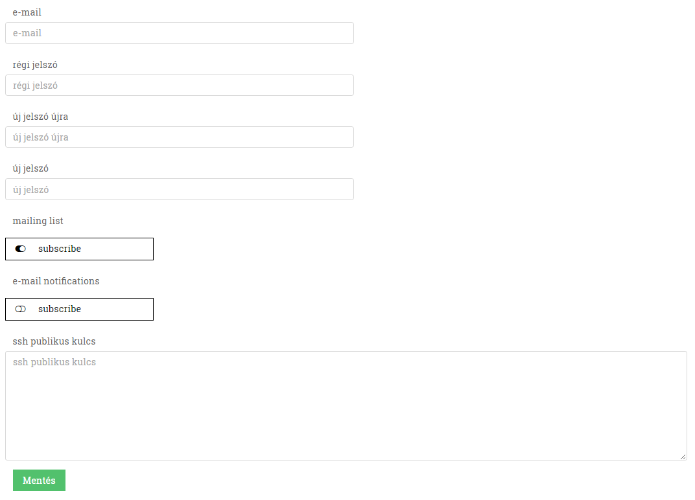

Beállítások

8. Kijelentkezés

1. A kijelentkezéssel a felhasználónak megszűnik a session-je.

2. A kijelentkezés után a felhasználó a bejelentkezés oldalra lesz átirányítva.

